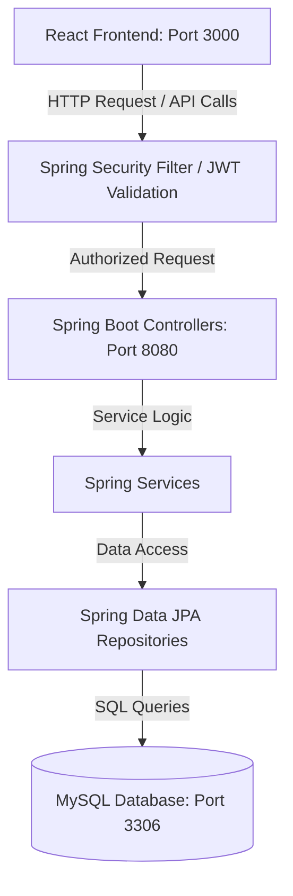
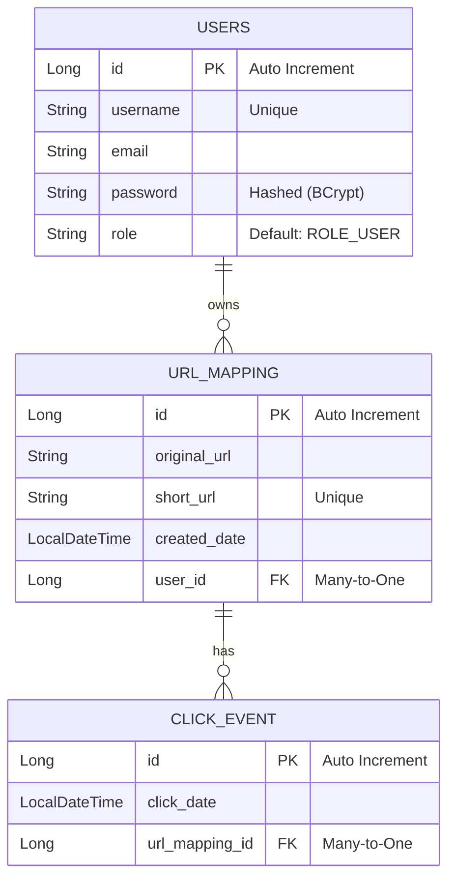
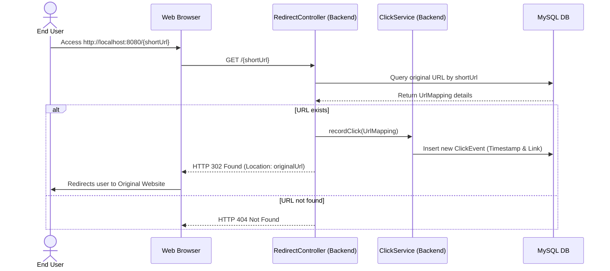

# Custom URL Shortener & Analytics Platform

A modern, full-stack URL Shortener application built using **Spring Boot 3.x** on the backend and **React 19** with **Tailwind CSS** on the frontend. This application allows users to register accounts, generate shortened URLs, track redirection metrics (click counts), and manage their links through an intuitive dashboard.

---

## 📖 Table of Contents

1. [Features](#-features)
2. [Tech Stack](#-tech-stack)
3. [System Architecture](#-system-architecture)
4. [Database Schema](#-database-schema)
5. [Directory Structure](#-directory-structure)
6. [API Reference](#-api-reference)
7. [Getting Started & Local Setup](#-getting-started--local-setup)
   - [Prerequisites](#prerequisites)
   - [Database Setup](#1-database-setup)
   - [Backend Configuration & Execution](#2-backend-configuration--execution)
   - [Frontend Configuration & Execution](#3-frontend-configuration--execution)
8. [Redirect & Analytics Flow](#-redirect--analytics-flow)

---

## ✨ Features

- **User Authentication:** Secure user registration and login using JWT (JSON Web Tokens) and Spring Security.
- **URL Shortening:** Generate clean, unique, short URL paths for any long target URL.
- **Redirection Service:** Instant redirection from the short URL to the original destination.
- **Real-time Analytics:** Automatically records click events with timestamps when a shortened URL is accessed.
- **Interactive Dashboard:** View, search, and manage user-specific shortened links and check their click statistics in real-time.
- **Responsive UI:** Modern, clean, dashboard styled with Tailwind CSS, utilizing a mobile-friendly design.

---

## 🛠️ Tech Stack

### Backend (`url-shortener-sb`)
- **Language/Framework:** Java 21 / Spring Boot 3.2.5
- **Security:** Spring Security & JWT (JSON Web Tokens)
- **Data Access:** Spring Data JPA / Hibernate
- **Database:** MySQL
- **Build Tool:** Maven
- **Utility:** Lombok

### Frontend (`url-shortener-ui`)
- **Library:** React 19
- **Routing:** React Router DOM (v7)
- **HTTP Client:** Axios (with request interceptors for token management)
- **Styling:** Tailwind CSS (v3) & PostCSS
- **Build Tool:** Create React App (React Scripts)

---

## 🏗️ System Architecture

The project is structured as a decoupled frontend-backend architecture.



### Authentication Flow
1. **User Login:** Client sends credentials to `/api/auth/login`.
2. **Token Generation:** On successful authentication, the backend generates a signed JWT and returns it in the response body.
3. **Subsequent Requests:** The React client stores the JWT in `localStorage` and appends it as a `Bearer` token inside the `Authorization` header for all requests to protected paths (`/api/urls/**`).
4. **JWT Filter:** The backend intercepts requests using `JwtAuthenticationFilter`, validates the signature, extracts the user details, and populates the `SecurityContext`.

---

## 🗄️ Database Schema

The system uses three tables to manage users, links, and analytics.



### Table Details
- **`users`**: Stores registration info with BCrypt hashed passwords.
- **`url_mapping`**: Holds the relationship between long and short URLs, mapped to the user who created them.
- **`click_event`**: Records the timestamp of each redirect event. Click counts are computed dynamically by counting matching click events.

---

## 📂 Directory Structure

Below is an overview of the key packages and files:

```text
url-shortener/
├── url-shortener-sb/                 # Spring Boot Backend
│   ├── src/main/java/com/url/shortener/
│   │   ├── controller/               # REST API Endpoints (Auth, Urls, Redirects)
│   │   ├── dtos/                     # Request/Response Data Transfer Objects
│   │   ├── models/                   # JPA Entity definitions (User, UrlMapping, ClickEvent)
│   │   ├── repository/               # Spring Data Repositories
│   │   ├── security/                 # Security Configurations & WebSecurityConfig
│   │   │   └── jwt/                  # JWT Utils, Filter, and Auth Response
│   │   ├── service/                  # Core Business Services (UrlService, ClickService)
│   │   └── UrlShortenerSbApplication.java  # Main Application Entrypoint
│   ├── src/main/resources/
│   │   └── application.properties    # DB details, JWT Secret & Spring Configuration
│   └── pom.xml                       # Maven Dependency Specification
│
├── url-shortener-ui/                 # React Frontend
│   ├── public/                       # Static Assets & HTML entrypoint
│   ├── src/
│   │   ├── components/               # Shared Layout components (Header, Footer, Dashboard cards)
│   │   ├── pages/                    # Route pages (Landing, Login, Register, Dashboard)
│   │   ├── services/                 # Axios configuration & API client wrappers
│   │   ├── App.js                    # React Router configuration
│   │   └── index.js                  # Frontend Entrypoint
│   ├── tailwind.config.js            # Tailwind Customizations
│   ├── postcss.config.js             # PostCSS Configuration
│   └── package.json                  # Frontend Dependencies & Scripts
└── README.md                         # Main Documentation (This file)
```

---

## 🔌 API Reference

### 🔐 Authentication Endpoints

#### Register a New User
* **Endpoint:** `POST /api/auth/register`
* **Access:** Public
* **Request Body:**
  ```json
  {
    "username": "john_doe",
    "email": "john@example.com",
    "password": "securepassword123"
  }
  ```
* **Success Response (200 OK):** `"User registered successfully!"`

#### Login User
* **Endpoint:** `POST /api/auth/login`
* **Access:** Public
* **Request Body:**
  ```json
  {
    "username": "john_doe",
    "password": "securepassword123"
  }
  ```
* **Success Response (200 OK):**
  ```json
  {
    "token": "eyJhbGciOiJIUzUxMiJ9.eyJzdWIiOiJqb2huX2RvZSIsImlhdCI6..."
  }
  ```

---

### 🔗 URL Shortener Endpoints

#### Create a Shortened URL
* **Endpoint:** `POST /api/urls`
* **Access:** Authenticated (JWT Required)
* **Headers:** `Authorization: Bearer <your_jwt_token>`
* **Request Body:**
  ```json
  {
    "originalUrl": "https://www.google.com"
  }
  ```
* **Success Response (200 OK):** `"short_1718649201"` (Returns the generated short path string)

#### Retrieve Authenticated User's URLs
* **Endpoint:** `GET /api/urls`
* **Access:** Authenticated (JWT Required)
* **Headers:** `Authorization: Bearer <your_jwt_token>`
* **Success Response (200 OK):**
  ```json
  [
    {
      "id": 1,
      "originalUrl": "https://www.google.com",
      "shortUrl": "short_1718649201",
      "createdDate": "2026-06-18T00:10:00",
      "clickCount": 5
    }
  ]
  ```

---

### 🔀 Redirection Endpoint

#### Redirect Short URL to Original URL
* **Endpoint:** `GET /{shortUrl}` (e.g. `GET http://localhost:8080/short_1718649201`)
* **Access:** Public
* **Action:** Increases click count by 1 (records click event) and returns `302 Found` with target location header.

---

## 🚀 Getting Started & Local Setup

### Prerequisites
- **Java Development Kit (JDK):** Version 21
- **Node.js:** v18 or newer (with npm)
- **Database:** MySQL Server running locally on port `3306`

---

### 1. Database Setup
Log into your MySQL console and create a database schema matching your properties configuration:

```sql
CREATE DATABASE urlshortenerdb;
```

---

### 2. Backend Configuration & Execution

1. Navigate to the backend directory:
   ```bash
   cd url-shortener-sb
   ```

2. Open `src/main/resources/application.properties` and verify your MySQL credentials and JWT configuration details:
   ```properties
   spring.datasource.url=jdbc:mysql://localhost:3306/urlshortenerdb
   spring.datasource.username=root
   spring.datasource.password=password
   jwt.secret=Y2hvb25nZWV0aGVpZ2h0aWVzYW5kZmlmdHlzaXhiaXRzZXNzdXBlcnNlY3VyZQ==
   jwt.expiration=172800000
   ```

3. Build and launch the Spring Boot application using Maven:
   ```bash
   ./mvnw spring-boot:run
   ```
   *The backend will run on **`http://localhost:8080`**.*

---

### 3. Frontend Configuration & Execution

1. Navigate to the frontend directory:
   ```bash
   cd ../url-shortener-ui
   ```

2. Install the necessary project dependencies:
   ```bash
   npm install
   ```

3. Launch the React development server:
   ```bash
   npm start
   ```
   *The frontend will open in your default browser at **`http://localhost:3000`**.*

---

## 🔄 Redirect & Analytics Flow

When a visitor clicks a shortened URL, the following background process takes place:



### Testing Integrations
You can run integration tests on the backend to verify functionality:
```bash
cd url-shortener-sb
./mvnw test
```
